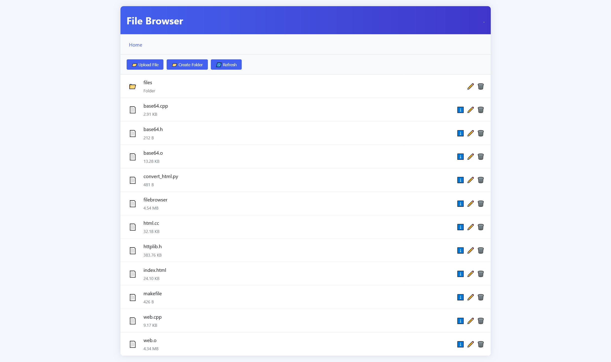

# File Browser - 简单Web文件浏览器

File Browser 是一个基于C++和[httplib](https://github.com/yhirose/cpp-httplib)的轻量级 Web 文件浏览器，允许用户通过网页界面管理指定目录内的文件和目录。提供了浏览、上传、下载、重命名、删除以及创建目录等功能。



## 主要功能
* **文件浏览**：查看目录结构和文件列表
* **文件上传**：支持大文件分块上传（10MB/块）

* **文件上传**：支持文件下载功能

* **文件下载**：重命名、删除文件

* **目录操作**：创建、删除目录

* **自定义界面**：支持外部 HTML 页面
## 编译和安装
```
# 编译
make

# 将内置的文件管理器网页更新为源码的index.html (需要python3)
make html

# 清理
make clean
```
## 运行参数
```
# 默认设置（端口为8080，根目录为./files）
./filebrowser

# -d 自定义根目录
./filebrowser -d /path/to/your/directory #自定义根目录为 /path/to/your/directory

# -p 自定义端口
./filebrowser -p 8081 #自定义端口为8081
```
## 前端使用逻辑
程序会优先使用当前目录下的 ```index.html``` 作为前端界面。如果没有找到，则使用内置的默认界面。